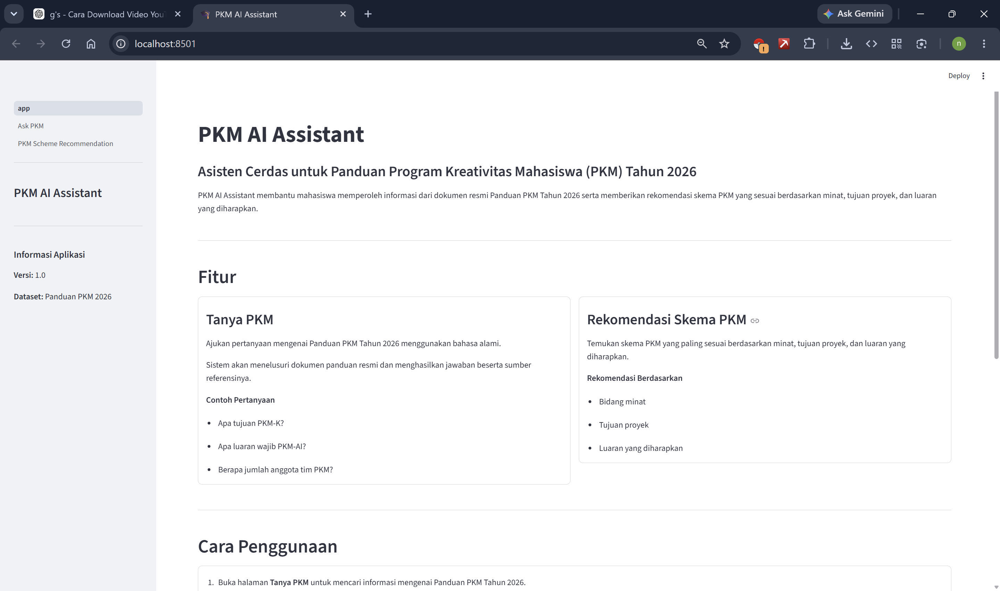
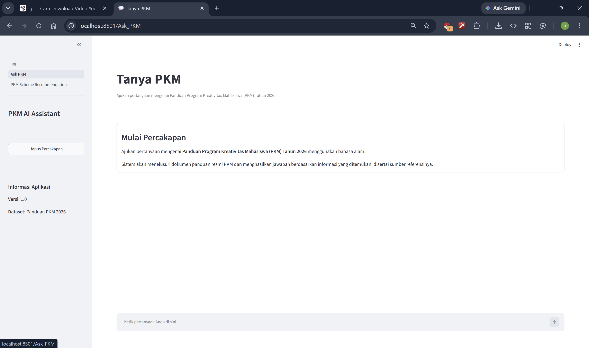
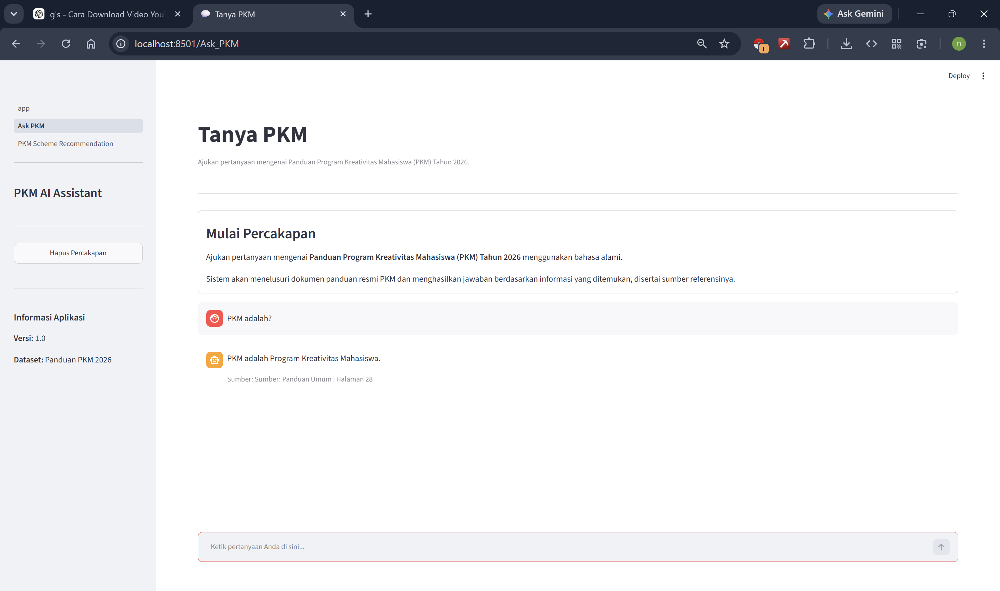
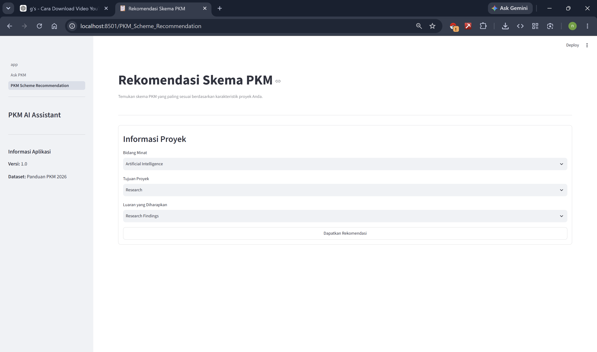
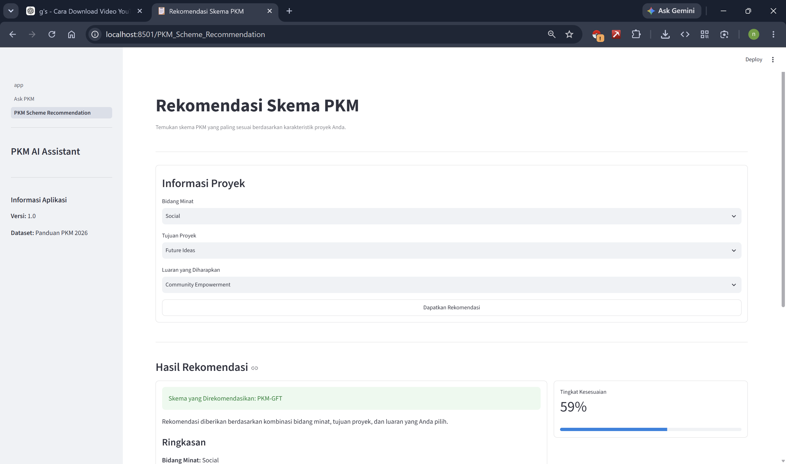

# PKM AI Assistant

PKM AI Assistant is a Retrieval-Augmented Generation (RAG)-based web application designed to help students explore the **2026 Program Kreativitas Mahasiswa (PKM) Guidelines**. The application retrieves relevant information from the official PKM guideline documents and generates contextual answers with source citations.

In addition to the chatbot, the application provides a **PKM Scheme Recommendation** feature that recommends the most suitable PKM scheme based on the user's area of interest, project objective, and expected output.

---

## Features

### Ask PKM

- Ask questions using natural language
- Retrieval-Augmented Generation (RAG)-based chatbot
- Generates answers from the official PKM Guidelines
- Displays source citations for every response

### PKM Scheme Recommendation

- Rule-based recommendation system
- Recommends the most suitable PKM scheme based on:
  - Area of interest
  - Project objective
  - Expected output
- Displays a compatibility score for each recommendation

---

## Technology Stack

- Python
- Streamlit
- LangChain
- ChromaDB
- HuggingFace Embeddings
- Groq LLM

---

## Workflow

```text
                 Official PKM Guidelines (PDF)
                            │
                            ▼
                    Document Loading
                            │
                            ▼
                      Text Chunking
                            │
                            ▼
               HuggingFace Embeddings
                            │
                            ▼
                        ChromaDB
                            │
                            ▼
                        Retriever
                            │
                            ▼
                         Groq LLM
                            │
                            ▼
                   Generated Response
```

---

## Project Structure

```text
PKM-AI-Assistant/
│
├── app.py
├── requirements.txt
├── README.md
│
├── data/
│   ├── raw/
│   └── processed/
│
├── pages/
│   ├── 1_Ask_PKM.py
│   └── 2_PKM_Scheme_Recommendation.py
│
├── src/
│   ├── build_index.py
│   ├── chatbot.py
│   ├── llm.py
│   ├── recommendation.py
│   └── retriever.py
│
├── vector_db/
│
└── streamlit_output/
```

---

## Screenshots

### Home

Landing page of the PKM AI Assistant.



---

### Ask PKM

Main interface for asking questions about the 2026 PKM Guidelines.



---

### Ask PKM – Example Conversation

Example interaction between a user and the chatbot.



---

### PKM Scheme Recommendation

Interface for selecting project characteristics.



---

### Recommendation Result

Recommendation result with compatibility score.



---

## Demo Video

Watch the application demonstration on YouTube:

https://youtu.be/iy7aYrPqlYw

---

## Installation

Clone the repository.

```bash
git clone https://github.com/your-username/PKM-AI-Assistant.git
```

Navigate to the project directory.

```bash
cd PKM-AI-Assistant
```

Install the required dependencies.

```bash
pip install -r requirements.txt
```

---

## Build the Vector Database

Before running the application, build the vector database from the PKM guideline documents.

```bash
python src/build_index.py
```

---

## Run the Application

Start the Streamlit application.

```bash
streamlit run app.py
```

---

## Example Questions

- What is the objective of PKM-K?
- What is the mandatory output of PKM-AI?
- How many members are allowed in a PKM team?
- What is the objective of PKM-GFT?
- Who is eligible to submit a PKM proposal?

---

## Data Source

Official **2026 Program Kreativitas Mahasiswa (PKM) Guidelines** published by the **Ministry of Higher Education, Science, and Technology of the Republic of Indonesia**.

---

## Demo Features

- RAG-based document question answering
- Automatic source citation
- Rule-based PKM scheme recommendation
- Interactive Streamlit user interface

---

## Author

Nailul Muna

Developed as the final project for the **Trend and Topic Analysis** course.
